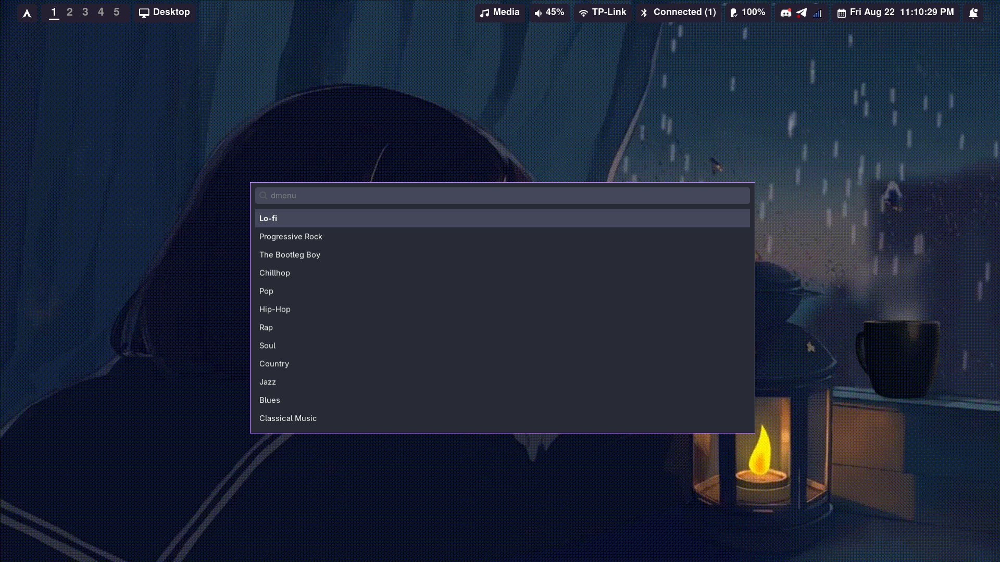

# Wofi-Lofi
A simple tool to listen to radio on linux via wofi with the possibility to add and remove stations.



## Dependencies
1. wofi
2. python3
3. mpv
4. python-mpv (python3-mpv on Ubuntu)
5. notify-send

### Arch:
```
sudo pacman -S wofi mpv python-mpv notify-osd
```
### Ubuntu:
```
sudo apt install wofi mpv python3-mpv notify-osd
```

## Installation

```
git clone https://github.com/flarkc/Wofi-Lofi
cd Wofi-Lofi
python3 start.py
```
## Usage

### Purpose of files
The main code that starts the player and opens the station selection menu is in `wofi-radio.py`. When you run `start.py`, it stops the current listening and starts `wofi-radio.py`, so you should use it rather than `wofi-radio.py` if you need to bind the script to a hotkey. Then you can stop the player by just running the script and closing wofi. 

`edit-stations.py` can be opened via the option "⚙️ CONFIGURE STATIONS" in the station selection menu. It allows you to add new stations and delete existing ones. To add a new station you need a name (under which the station will be displayed in wofi) and a **streaming url** to the station. 


`stations.json` stores station data. it is edited using `edit-stations.py`.